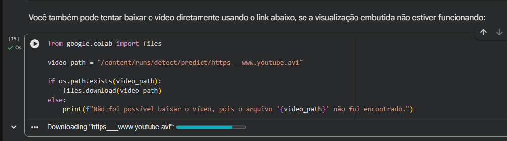
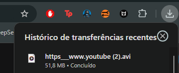

# Indentificação
        INTEGRANTES	

        Gabriel Barros Albertini - 10419482
        Rafael de Menezes Ros - 10417954
        Vinicius Alves Marques - 10417880
        Felipe do Nascimento Fonseca - 10409389
# Síntese do conteúdo do arquivo
       Caso alguma coisa falhe ou seja de interesse baixar o arquivo, esse fonte permite o download direto do .avi
# Código
        from google.colab import files

        video_path = "/content/runs/detect/predict/https___www.youtube.avi"

        if os.path.exists(video_path):
        files.download(video_path)
        else:
        print(f"Não foi possível baixar o vídeo, pois o arquivo '{video_path}' não foi encontrado.")

# Resultado

